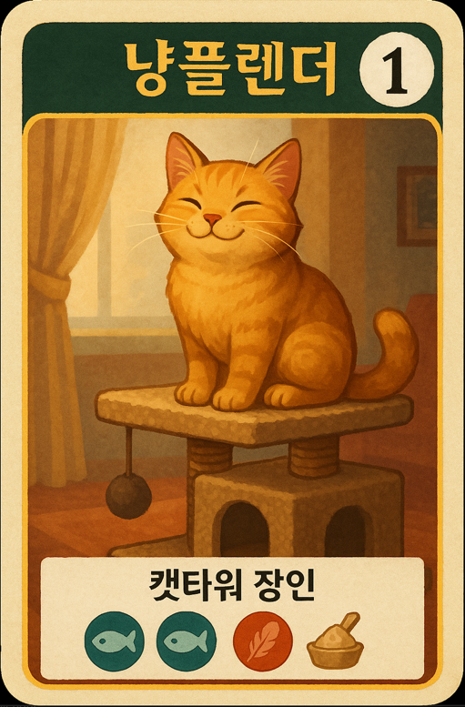

## Guide
### Objects
Token:
- Emerald 7
- Diamond 7
- Sapphire 7
- Onyx 7
- Gold (Joker) 7

Development Card:
- Level1 40
- Level2 30
- Level3 20

Noble Tile: 10

---
### Game Setup
2인 플레이:
- Gold를 제외하고 각 보석은 4개씩만 사용
- 3장의 귀족타일 사용

3인 플레이:
- Gold를 제외하고 각 보석은 5개씩만 사용
- 4장의 귀족타일 사용

---
### Game Rules
#### Actions
1. 토큰 가져오기: 서로 다른 색의 토큰 3개 or 같은 색의 토큰 2개 가져오기
   1. 토큰은 최대 10개까지 보유 가능. 그 이상은 반환 가능
   2. 같은 색의 토큰은 4개 이상 남아있을 때만 가져올 수 있음
2. 카드 예약 + Gold 토큰 가져오기: 공개된 카드 혹은 레벨별 덱의 맨 윗 카드 중 1개를 예약
   1. 덱에서 예약한 카드는 미공개
   2. 예약은 최대 3장까지 가능
   3. 예약된 카드는 구매를 해야만 제거가 됨
   4. Gold 토큰이 남아있지 않아도 예약은 가능하지만 토큰 수령은 불가
3. 개발카드 혹은 예약카드 구매하기
   1. 보유한 토큰 + 보유한 카드의 보너스 토큰으로 구매

#### Passive rule
1. 턴 종료시 공개된 귀족 타일이 요구하는 개발카드의 개수 조건을 만족하면 자동으로 귀족 타일을 수령
2. 턴마다 1개의 타일만 수령 가능

#### End of the game
1. 한 명의 플레이어가 15 명성 포인트에 도달하면, 각 플레이어들이 동등한 횟수의 차례를 가진 후 종료
2. 가장 명성 포인트가 높은 플레이어가 승리
3. 동률이라면 개발 카드를 적게 구입한 플레이어가 승리
4. 동률이라면 무승부
